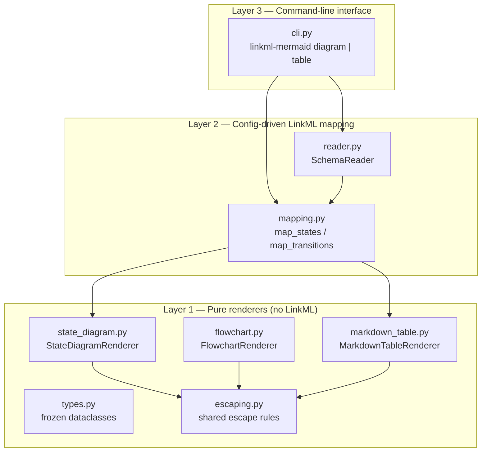

# Architecture

`linkml-mermaid` is organised in three layers, all of which ship in this package.



## Layer 1 — Pure renderers

Knows nothing about LinkML. You can use it standalone with hand-built
`MermaidState` / `MermaidTransition` objects.

| Module | Responsibility | Spec |
| --- | --- | --- |
| `types.py` | Frozen dataclasses: `MermaidState`, `MermaidTransition`, `FlowchartNode`, `FlowchartEdge`, `ColumnDef`, … | — |
| `escaping.py` | The escape rules every renderer shares, so a quote or a pipe cannot break the output | [flowchart §entity codes](https://mermaid.js.org/syntax/flowchart.html), [GFM §4.10](https://github.github.com/gfm/#tables-extension-) |
| `state_diagram.py` | `StateDiagramRenderer` → Mermaid `stateDiagram-v2` | [stateDiagram](https://mermaid.js.org/syntax/stateDiagram.html) |
| `flowchart.py` | `FlowchartRenderer` → Mermaid `flowchart` | [flowchart](https://mermaid.js.org/syntax/flowchart.html) |
| `markdown_table.py` | `MarkdownTableRenderer` → GFM §4.10 pipe tables | [GFM tables](https://github.github.com/gfm/#tables-extension-) |

Escaping is centralised deliberately. Three renderers each writing their own
`.replace('"', ...)` is three places for a quote to slip through; one module
means one place to fix, and one corpus of hostile inputs to test against.

## Layer 2 — Config-driven mapping

Reads your LinkML schema and maps typed instances to Layer 1 primitives via a
`StateDiagramConfig`.

| Module | Responsibility | Spec |
| --- | --- | --- |
| `reader.py` | `SchemaReader` — a read-only façade over `linkml_runtime.SchemaView` with auto-discovery of `mermaid_role` annotations | [SchemaView](https://linkml.io/linkml/developers/schemaview.html) |
| `mapping.py` | `map_states`, `map_transitions`, `build_table_rows`, `build_state_descriptions` — works with dicts, dataclasses and Pydantic models | [Annotations](https://linkml.io/linkml/schemas/annotations.html) |

## Layer 3 — Command-line interface

`cli.py` provides `linkml-mermaid diagram` and `linkml-mermaid table`, which
wire Layer 2 to Layer 1 for the common case: a schema, a data file, and a
diagram on standard output or in a file. It holds no rendering logic of its own,
so anything the CLI can do the Python API can do too.

A consuming project that needs more — domain-specific overrides, template
injection, custom data loading — calls Layer 2 directly rather than shelling
out.

## Shipped vocabulary

The package ships an annotation-vocabulary schema:

```
vocab/
├── mermaid_annotations.yaml   # annotation vocabulary (LinkML schema)
└── __init__.py                # Python constants for annotation values
```

See the **[Annotation Vocabulary](/annotations)** reference for the full list of
`mermaid_role` values.
