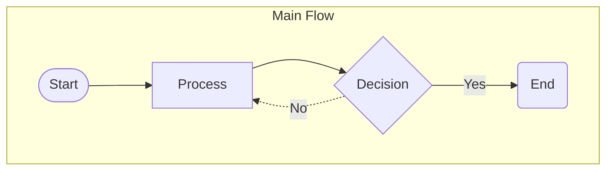

# Flowchart Renderer

The `FlowchartRenderer` generates Mermaid `flowchart` diagrams from simple
dataclasses. It is a **Layer 1** renderer — no schema or annotations required.

```python
from linkml_mermaid import FlowchartRenderer, FlowchartNode, FlowchartEdge, FlowchartSubgraph

nodes = [
    FlowchartNode("A", "Start", shape="stadium"),
    FlowchartNode("B", "Process", shape="rect"),
    FlowchartNode("C", "Decision", shape="diamond"),
    FlowchartNode("D", "End", shape="round"),
]
edges = [
    FlowchartEdge("A", "B"),
    FlowchartEdge("B", "C"),
    FlowchartEdge("C", "D", label="Yes"),
    FlowchartEdge("C", "B", label="No", style="dotted"),
]
subgraphs = [FlowchartSubgraph("main", "Main Flow", ["A", "B", "C", "D"])]

renderer = FlowchartRenderer(direction="TD")
print(renderer.render(nodes, edges, subgraphs))
```

The call above renders to:



## Supported node shapes

| Shape | Mermaid syntax |
| --- | --- |
| `rect` | `["..."]` |
| `round` | `("...")` |
| `stadium` | `(["..."])` |
| `diamond` | `{"..."}` |
| `hexagon` | `{{"..."}}` |
| `subroutine` | `[["..."]]` |
| `circle` | `(("..."))` |

## Supported edge styles

| Style | Mermaid syntax |
| --- | --- |
| `solid` | `-->` |
| `dotted` | `-.->` |
| `thick` | `==>` |

Links are always drawn with an arrow head. Mermaid's open-link forms (`---`,
`-.-`, `===`) are not emitted; see
[`docs/standards/coverage.md`](https://github.com/ASCS-eV/linkml-mermaid/blob/main/docs/standards/coverage.md).

## Invalid input is rejected

An unknown shape or style raises `ValueError` at construction time rather than
producing diagram text that Mermaid cannot parse:

```python
FlowchartNode("A", "Start", shape="octagon")
# ValueError: Invalid shape 'octagon'; must be one of [...]
```

The same applies to a subgraph that lists a node which was never declared — a
typo in a member list would otherwise produce a silently empty box.

## Labels are escaped

Node labels, edge labels and subgraph titles all pass through
`escape_mermaid_text`, which encodes `#` as `#35;` and `"` as `#quot;` using the
entity-code mechanism the flowchart specification documents. A node labelled
`Say "hello"` renders as a node that says `Say "hello"`, not as a syntax error.

The `#` must be encoded first; otherwise an input already containing `#quot;`
would be indistinguishable from the escaper's own output.
