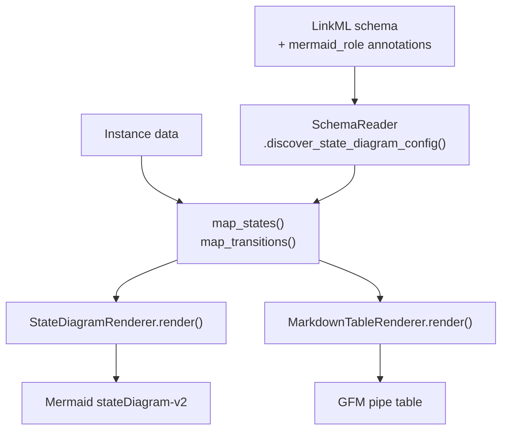

## The problem

LinkML already generates diagrams — seven generators, including `gen-erdiagram`
and `gen-mermaid-class-diagram`. Every one of them renders the **schema**:
classes, slots, ranges, inheritance.

That is the wrong answer when the question is "what does my *data* look like?".

A schema that models a workflow says *a Transition has a from_state and a
to_state*. Only the instance data says *Draft goes to InReview when a Reviewer
approves it*. A class diagram of that schema shows three boxes and tells a
reader nothing about the workflow. The diagram people want is a state machine,
and it can only be drawn from the instances.

So teams draw it by hand, and the hand-drawn copy drifts away from the schema on
the first change nobody remembers to mirror.

[`linkml/linkml#915`](https://github.com/linkml/linkml/issues/915) — *"Add
dumpers for mermaid, markdown"* — has been open since 2022.

## The solution

Annotate the schema once to say which slot means "source state" and which means
"guard". The diagram is then generated from the data, every time it is needed.



Or skip Python entirely:

```bash
linkml-mermaid diagram -s schema.yaml -d data.yaml -c Workflow --direction LR
```

## Prior art

[`linkml/linkml-renderer`](https://github.com/linkml/linkml-renderer) is the
only other tool that renders LinkML *instance* data to Mermaid. It emits a
`graph TB` flowchart configured by an external style file. If you want a generic
object graph, use it. If you are modelling a state machine and want it drawn as
one — guards on the arrows, a table of states beside it — that is this package.

Ready to try it? Head to **[Getting Started](/getting-started)**.
